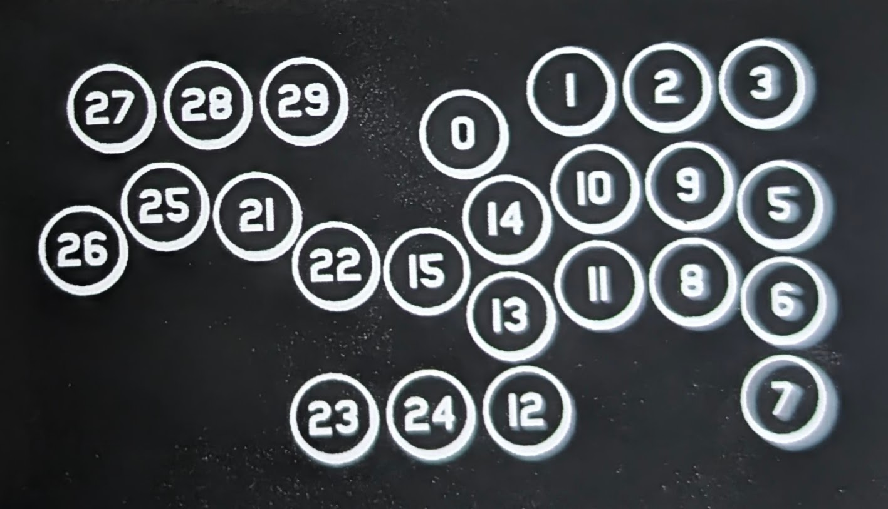

# Rushbox用 配信画面に押してるボタンを出すやつ

Twitchなどで格ゲー配信するときにボタンのどこを押しているのかわかるやつです。

参考 <https://x.com/myamyu/status/1937189141760082256>

---

- [Rushbox用 配信画面に押してるボタンを出すやつ](#rushbox用-配信画面に押してるボタンを出すやつ)
  - [注意](#注意)
  - [使い方](#使い方)
    - [ボタンのマッピング](#ボタンのマッピング)
    - [配信画面に表示する](#配信画面に表示する)
  - [自身のRushbox画像に差し替えたい](#自身のrushbox画像に差し替えたい)
    - [コントローラーのサイズや位置調整](#コントローラーのサイズや位置調整)

---

## 注意

XInput modeのみ動作します。

## 使い方

### ボタンのマッピング

profileごとにHTMLファイルを作成し、下の方にあるマッピングを変えてください。

```js
(function () {
    const buttonHandler = new ButtonHandler({
        // 移動
        "Left": "Button25",
        "Down": "Button21",
        "Right": "Button22",
        "Up": "Button24",
        // ABXY
        "A": "Button14",
        "B": "Button10",
        "X": "Button9",
        "Y": "Button5",
        // LR
        "LB": "Button11",
        "LT": "Button13",
        "LS": "Button26",
        "RB": "Button8",
        "RT": "Button7",
        "RS": "Button12"
    });
})();
```

ButtonNNの番号はRushboxの背面にある番号と一致させています。  
※ 天板部分のみ対応です。27, 28, 29, 1, 2, 3は対応してません。



### 配信画面に表示する

ソースに「ブラウザ」を追加し、profile1.html などをプロファイルに合わせて設定してください。 
幅と高さはcss内のbodyの値を設定してください。

```css
    /* 画像サイズに合わせる */
    width: 800px;
    height: 433px;
```

## 自身のRushbox画像に差し替えたい

画像を配置し、[index.css](./index.css)で画像パスを修正してください。

```css
background-image: url(Rushbox.png);
```

### コントローラーのサイズや位置調整

- bodyのwidth, heightを画像サイズに合わせてください。
- ボタンの大きさに合わせて.big, .smallのサイズを調整してください。
- ボタンの位置に合わせて `#Buton0` ～ `#Button26` の座標を調整してください。
